<!-- MATHEMATICAL PROFILE -->

# `Aravindhan ≡ reasoning · engineering · curiosity`

systems thinker · experimental builder · AI-native engineer

 

<code>decode(the graph)</code>

 

My GitHub activity translated into mathematical terrain: time, contribution intensity, active days, and a changing attractor generated from live data.

`activity → structure → signal → visual identity`

---

### `01 / identity.state`

`identity · phase coherence · motion · systems`

live GitHub data changes the geometry — the counters stay in the portrait above.

---

### `02 / phase.field`

 

`motion · interference · attractors · vector flow`

a continuous mathematical system — no controls, no game state, just evolving geometry.

---

### `03 / endpoints`

[`portfolio`](https://aravindh-dev12.github.io) · [`repositories`](https://github.com/Aravindh-dev12?tab=repositories) · [`email`](mailto:aravindh1653@gmail.com) · [`github`](https://github.com/Aravindh-dev12)

 

`constraint: complexity is allowed; confusion is not.`

<code>unknown → pattern → understanding → creation</code>

