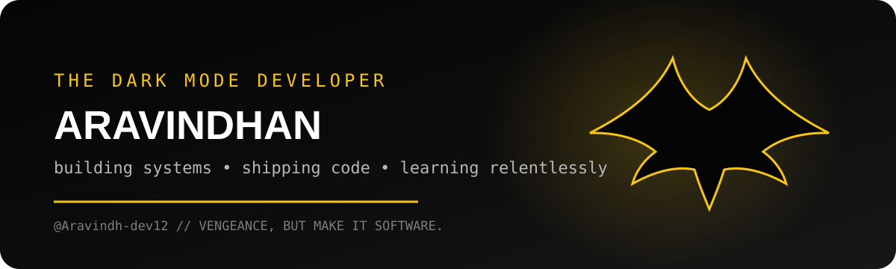

<div align="center">



# 🦇 Aravindhan

### Developer by day. Dark Mode by choice.

[](https://github.com/Aravindh-dev12)


</div>

---

## 🦇 The Developer Behind the Mask

```text
IDENTITY      Aravindhan
HANDLE        @Aravindh-dev12
BASE          GitHub
MODE          Dark
MISSION       Build useful things. Ship relentlessly. Keep learning.
STATUS        Coding somewhere beneath the Bat-Signal.
```

> “It’s not who I am underneath, but what I build that defines me.”

---

## 📊 Batcomputer // GitHub Intelligence

<div align="center">


</div>

<div align="center">


</div>

---

## 📡 Gotham Activity Feed

<div align="center">


</div>

---

## 🛠️ Utility Belt

<div align="center">


</div>

---

<div align="center">

### 🦇 THE CODE IS THE SIGNAL.

`Aravindh-dev12 / building from the shadows`

</div>
