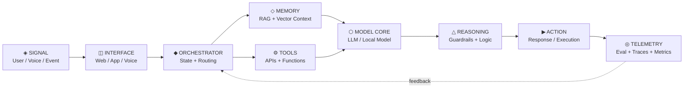

<!-- ============================================================ -->
<!--              ARAVINDHAN // FUTURE SYSTEMS CONSOLE            -->
<!-- ============================================================ -->

<div align="center">


<a href="https://github.com/Aravindh-dev12">
  
</a>

<p>
  
  
  
  
</p>

<p>
  <a href="mailto:aravindh1653@gmail.com"></a>
  <a href="https://aravindh-dev12.github.io"></a>
  <a href="https://github.com/Aravindh-dev12"></a>
</p>

<sub><code>BUILDING THE INTERFACE BETWEEN INTELLIGENCE × SOFTWARE × PEOPLE</code></sub>

</div>

---

## `01 // IDENTITY_MATRIX`

```yaml
entity: ARAVINDHAN
class: AI_BUILDER × FULL_STACK_DEVELOPER
state: continuous_iteration

mission:
  - engineer_ai_native_products
  - turn_research_into_working_systems
  - build_interfaces_for_intelligence
  - ship_beyond_the_demo

current_signal:
  - LLM_ENGINEERING
  - RAG_AND_MEMORY
  - AGENTIC_WORKFLOWS
  - REAL_TIME_VOICE_AI
  - NEURO_SYMBOLIC_REASONING
  - PRODUCT_ENGINEERING

philosophy: "Build in the shadows. Ship in the light."
```

I build **AI-native applications, intelligent interfaces, and production-oriented full-stack systems** — with a focus on turning emerging AI capabilities into software that is useful, observable, and shippable.

> `PRIMARY OBJECTIVE // Make intelligence operational.`

---

## `02 // SYSTEM_STACK`

<div align="center">

### `CORE LANGUAGES`


### `APPLICATION LAYER`


### `INFRASTRUCTURE LAYER`


<br/>


</div>

---

## `03 // INTELLIGENCE_ARCHITECTURE`



<div align="center">

```text
SIGNAL  ──▶  RETRIEVE  ──▶  REASON  ──▶  ACT  ──▶  OBSERVE  ──▶  EVOLVE
  UI          CONTEXT          AI         TOOLS       EVAL          SYSTEM
```

</div>

---

## `04 // FEATURED_SYSTEMS`

<table>
<tr>
<td width="50%" valign="top">

### `SYS.01 //` ⚡ [Cieav-web](https://github.com/Aravindh-dev12/Cieav-web)

**High-performance AI interface experimentation**

`Vue 3` · `WebGPU` · `Vite` · `AI Interfaces`

Browser-first experimentation at the edge of **interactive AI + accelerated web experiences**.

</td>
<td width="50%" valign="top">

### `SYS.02 //` 🎙️ [Looca Voice AI Agent](https://github.com/Aravindh-dev12/Looca-Voice-AI-Agent)

**Production-oriented conversational intelligence**

`Next.js` · `TypeScript` · `FastAPI` · `PostgreSQL` · `Qdrant` · `Redis`

A full-stack voice AI system combining **real-time interaction, retrieval, state, and persistence**.

</td>
</tr>
<tr>
<td width="50%" valign="top">

### `SYS.03 //` 🧬 [NeuroSymbolic Meta-Reasoning Agent](https://github.com/Aravindh-dev12/NeuroSymbolic-meta-reasoning-agent)

**Hybrid neural + symbolic reasoning**

`Python` · `Local LLMs` · `Vector Memory` · `Docker`

Research-oriented work on systems that combine **generative models, structured reasoning, and memory**.

</td>
<td width="50%" valign="top">

### `SYS.04 //` 🌐 [My Portfolio](https://github.com/Aravindh-dev12/My-Portfolio)

**Personal developer command surface**

`Next.js` · `TypeScript`

A digital interface for **projects, experiments, systems, and things I ship**.

</td>
</tr>
</table>

---

## `05 // LIVE_SIGNAL`

<div align="center">


<br/>


<br/><br/>


</div>

---

## `06 // RESEARCH_VECTOR`

```text
╭──────────────────────────────────────────────────────────────────────────╮
│                                                                          │
│   [01]  AGENTIC AI          ▰▰▰▰▰▰▰▰▰░   tool use + orchestration       │
│   [02]  RAG + MEMORY        ▰▰▰▰▰▰▰▰░░   retrieval + persistent context │
│   [03]  VOICE / MULTIMODAL  ▰▰▰▰▰▰▰░░░   real-time intelligent UX       │
│   [04]  NEURO-SYMBOLIC      ▰▰▰▰▰▰░░░░   structured machine reasoning   │
│   [05]  PRODUCT SYSTEMS     ▰▰▰▰▰▰▰▰▰░   resilient full-stack shipping  │
│                                                                          │
╰──────────────────────────────────────────────────────────────────────────╯
```

<div align="center">

`LLM` → `CONTEXT` → `MEMORY` → `AGENT` → `TOOLS` → `OBSERVABILITY` → `PRODUCT`

</div>

---

## `07 // ENGINEERING_PROTOCOL`

```python
class BuildProtocol:
    def execute(self, idea):
        system = prototype(idea)
        evidence = test(system)
        telemetry = measure(evidence)
        system = refine(system, telemetry)
        return ship(system)

RULES = {
    "utility": "real_world > demo_theatre",
    "architecture": "composable > clever",
    "ai": "grounded + evaluated + observable",
    "iteration": "continuous",
    "humans": "always_in_control",
}
```

---

## `08 // TRANSMISSION_CHANNEL`

<div align="center">

### `◈ CHANNEL OPEN`

Interested in **AI systems, developer tools, experimental interfaces, open-source collaboration, and ambitious product engineering**.

<br/>

<a href="mailto:aravindh1653@gmail.com"></a>
<a href="https://aravindh-dev12.github.io"></a>

<br/><br/>


<br/><br/>

```text
> FUTURE_SYSTEMS_CONSOLE
> Curiosity compounds. Systems evolve. Shipping wins.
> END_OF_TRANSMISSION_▮
```


</div>
