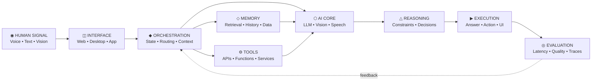

<!-- ============================================================ -->
<!--              ARAVINDHAN // SYNTHETIC SYSTEMS NODE            -->
<!-- ============================================================ -->

<div align="center">


<a href="https://github.com/Aravindh-dev12">
  
</a>

<p>
  
  
  
</p>

<p>
  <a href="mailto:aravindh1653@gmail.com"></a>
  <a href="https://aravindh-dev12.github.io"></a>
  <a href="https://github.com/Aravindh-dev12?tab=repositories"></a>
</p>

<sub><code>INTELLIGENCE × SOFTWARE × INTERFACES × REAL-WORLD SYSTEMS</code></sub>

</div>

---

## `00 // SYSTEM_IDENTITY`

```text
╭──────────────────────────────────────────────────────────────────────────────╮
│  ENTITY      :: ARAVINDHAN                                                   │
│  ROLE        :: AI SYSTEMS ENGINEER / FULL-STACK BUILDER                     │
│  STATE       :: CONTINUOUS_ITERATION                                         │
│  DIRECTIVE   :: TURN EMERGING AI CAPABILITIES INTO WORKING SOFTWARE          │
│  SIGNAL      :: AGENTS • MULTIMODAL • REAL-TIME • WEBGPU • PRODUCT SYSTEMS   │
╰──────────────────────────────────────────────────────────────────────────────╯
```

I build **AI-native products, real-time intelligent interfaces, and production-oriented full-stack systems**.

The work I care about lives between **research and deployment**: taking models, retrieval, audio, vision, browser graphics, APIs, state, and infrastructure — then turning them into software people can actually use.

> `PRIMARY DIRECTIVE // MAKE INTELLIGENCE OPERATIONAL.`

---

## `01 // ACTIVE_MISSION`

```yaml
mission:
  build:
    - ai_native_products
    - multimodal_interfaces
    - production_grade_full_stack_systems

  explore:
    - agentic_workflows
    - rag_and_memory
    - real_time_voice_ai
    - browser_accelerated_interfaces
    - human_ai_interaction

  optimize_for:
    - usefulness
    - observability
    - latency
    - composability
    - shipping

  protocol: "prototype -> measure -> refine -> release"
```

---

## `02 // TECHNOLOGY_MATRIX`

<div align="center">

### `LANGUAGE CORE`


### `APPLICATION LAYER`


### `SYSTEM LAYER`


<br/>


</div>

---

## `03 // VERIFIED_BUILDS`

<table>
<tr>
<td width="50%" valign="top">

### `SYS.01 // CIEAV AI`

**Browser-native experimental product interface**

`Vue 3` · `Vite` · `WebGPU` · `Canvas 2D` · `Zustand`

Realtime hero rendering with a progressive WebGPU path and Canvas fallback — built around motion, responsive interaction, and accelerated web visuals.

[**ACCESS REPOSITORY →**](https://github.com/Aravindh-dev12/Cieav-web)

</td>
<td width="50%" valign="top">

### `SYS.02 // CASCADE`

**Multimodal interview-practice assistant**

`Python` · `Gemini` · `NVIDIA Nemotron / Riva` · `Vision` · `Streaming ASR`

Windows desktop overlay combining live microphone/system-audio transcription, contextual chat, screen-aware Q&A, and queued real-time AI responses.

[**ACCESS REPOSITORY →**](https://github.com/Aravindh-dev12/cascade-interview-assistant)

</td>
</tr>
<tr>
<td width="50%" valign="top">

### `SYS.03 // ORIKS EPC`

**Production-oriented renewable-energy web platform**

`React 19` · `TypeScript` · `Vite` · `React Router`

Component-driven corporate frontend for renewable EPC, power evacuation, grid connectivity, infrastructure services, and technical project enquiries.

[**ACCESS REPOSITORY →**](https://github.com/Aravindh-dev12/Oriks-EPC)

</td>
<td width="50%" valign="top">

### `SYS.04 // INBOX ALLOCATION CORE`

**Atomic backend allocation workflow**

`Node.js` · `TypeScript` · `PostgreSQL`

Backend system for atomic allocation, claim/resolve flows, operator state, grace windows, workers, schema, and seed data.

[**ACCESS REPOSITORY →**](https://github.com/Aravindh-dev12/Inbox-Alloc-Code)

</td>
</tr>
</table>

---

## `04 // INTELLIGENCE_PIPELINE`



<div align="center">

```text
[ SIGNAL ] ──▶ [ CONTEXT ] ──▶ [ INTELLIGENCE ] ──▶ [ ACTION ] ──▶ [ TELEMETRY ]
      ▲                                                                         │
      └────────────────────────────── EVOLVE ◀──────────────────────────────────┘
```

</div>

---

## `05 // LIVE_TELEMETRY`

<div align="center">


<br/>


<br/><br/>


</div>

---

## `06 // RESEARCH_VECTOR`

```text
┌──────────────────────────┬──────────────────────────────────────────────────┐
│ VECTOR                   │ CURRENT DIRECTION                                │
├──────────────────────────┼──────────────────────────────────────────────────┤
│ AGENTIC SYSTEMS          │ orchestration • tools • autonomous workflows     │
│ RAG + MEMORY             │ retrieval • context • persistent intelligence    │
│ VOICE + MULTIMODAL       │ streaming ASR • vision • low-latency interaction │
│ WEBGPU INTERFACES        │ realtime graphics • accelerated browser UX       │
│ PRODUCT ENGINEERING      │ reliable systems • iteration • deployment        │
└──────────────────────────┴──────────────────────────────────────────────────┘
```

<div align="center">

`MODEL` → `CONTEXT` → `MEMORY` → `TOOLS` → `INTERFACE` → `OBSERVABILITY` → `PRODUCT`

</div>

---

## `07 // BUILD_PROTOCOL`

```python
class FutureSystem:
    def ship(self, idea):
        prototype = build(idea)
        evidence = test(prototype)
        telemetry = measure(evidence)
        refined = iterate(prototype, telemetry)
        return deploy(refined)

PRINCIPLES = {
    "utility": "real_world > demo_theatre",
    "architecture": "composable > complicated",
    "ai": "grounded + observable + useful",
    "interfaces": "fast + clear + alive",
    "iteration": "continuous",
    "humans": "always_in_control",
}
```

---

## `08 // TRANSMISSION_CHANNEL`

<div align="center">

### `◈ CHANNEL OPEN`

Building around **AI systems, multimodal interfaces, developer tools, experimental web experiences, and ambitious product engineering**.

<br/>

<a href="mailto:aravindh1653@gmail.com"></a>
<a href="https://aravindh-dev12.github.io"></a>

<br/><br/>


<br/><br/>

```text
> SYNTHETIC_SYSTEMS_NODE // ARAVINDHAN
> BUILD WHAT DOES NOT EXIST YET.
> OBSERVE. ITERATE. SHIP.
> END_OF_TRANSMISSION_▮
```


</div>
