<!-- ANIMATED PROFILE -->

 

**AI-native systems · realtime interfaces · WebGPU · infrastructure · experimental products**

 

[Portfolio](https://aravindh-dev12.github.io) · [Repositories](https://github.com/Aravindh-dev12?tab=repositories) · [Email](mailto:aravindh1653@gmail.com)

---

## What I build

I like projects where **models, interfaces, graphics, and infrastructure** have to behave as one system — not as separate layers glued together at the end.

- 🤖 AI-native products and agentic workflows
- ⚡ Realtime, multimodal interfaces
- 🎮 GPU and WebGPU experiments in the browser
- 🧩 Product infrastructure and developer tooling
- 🧪 Fast prototypes that turn strange ideas into working software

 

---

## Featured builds

### ⚡ [Cieav](https://github.com/Aravindh-dev12/Cieav-web)

Browser experiments built around **Vue + WebGPU**, exploring realtime graphics, GPU-native interaction, and interfaces that feel more like living systems than static pages.

### 🎙️ [Cascade](https://github.com/Aravindh-dev12/cascade-interview-assistant)

A **multimodal realtime AI interview practice** experience combining voice, vision, reasoning, and interactive feedback.

  <a href="https://github.com/Aravindh-dev12?tab=repositories"><strong>Explore all repositories →</strong></a>

---

## Contribution motion

<picture>
  <source media="(prefers-color-scheme: dark)" srcset="https://raw.githubusercontent.com/Aravindh-dev12/Aravindh-dev12/output/github-contribution-grid-snake-dark.svg" />
  <source media="(prefers-color-scheme: light)" srcset="https://raw.githubusercontent.com/Aravindh-dev12/Aravindh-dev12/output/github-contribution-grid-snake.svg" />
  
</picture>

Generated automatically from my GitHub contribution grid.

---

## Toolbox

---

### Build → break → learn → rebuild → ship.

Always experimenting. Usually somewhere between an idea and a working system.

