<!-- ARAVINDHAN // COGNITIVE PROFILE -->

<div align="center">

<br/>



<br/>

<sub><code>not a résumé. a running system.</code></sub>

<br/><br/>

</div>

```text
> profile.query("ARAVINDHAN")
> intent: build intelligence into usable software
> state:  OBSERVE → REASON → BUILD → SHIP → REPEAT
```

<details>
<summary><code>01 / inspect.identity()</code></summary>

<br/>

**Aravindhan** — building at the intersection of **AI systems, product engineering, real-time interaction, and experimental interfaces**.

I care about one transition:

```text
idea  ────────────────▶  working system
           ↑
      intelligence
```

</details>

<details>
<summary><code>02 / inspect.builds()</code></summary>

<br/>

**[Cieav](https://github.com/Aravindh-dev12/Cieav-web)**  
Experimental browser interface using Vue, WebGPU and realtime graphics.

**[Cascade](https://github.com/Aravindh-dev12/cascade-interview-assistant)**  
Multimodal practice system using realtime speech, vision and AI reasoning.

`[ explore all systems → ](https://github.com/Aravindh-dev12?tab=repositories)`

</details>

<details>
<summary><code>03 / open.channel()</code></summary>

<br/>

[portfolio](https://aravindh-dev12.github.io) · [email](mailto:aravindh1653@gmail.com) · [repositories](https://github.com/Aravindh-dev12?tab=repositories)

</details>

<br/>

<div align="center">

<sub><code>the interesting part is usually what has not been built yet.</code></sub>

</div>
