<!-- ARAVINDHAN // SIGNAL PROFILE -->

 

 

<code>Most things worth building begin invisible.</code>

  

<code>◦ SIGNAL DETECTED — OPEN</code>

 

### `ARAVINDHAN`

I build **AI systems and interfaces** that turn ideas into working products.

`AI` · `REAL-TIME` · `WEB` · `SYSTEMS`

 

[**Cieav**](https://github.com/Aravindh-dev12/Cieav-web) · [**Cascade**](https://github.com/Aravindh-dev12/cascade-interview-assistant) · [**More builds**](https://github.com/Aravindh-dev12?tab=repositories)

 

[portfolio](https://aravindh-dev12.github.io) · [email](mailto:aravindh1653@gmail.com)

 

<code>observe → build → disappear → return with something real</code>

  

◉ online somewhere between an idea and a release

  

