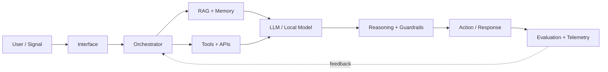

<!-- ============================================================ -->
<!--                  ARAVINDHAN // AI COMMAND CORE               -->
<!-- ============================================================ -->

<div align="center">


<a href="https://github.com/Aravindh-dev12">
  
</a>

<br/>


<br/><br/>

<a href="mailto:aravindh1653@gmail.com"></a>
<a href="https://aravindh-dev12.github.io"></a>
<a href="https://github.com/Aravindh-dev12"></a>

</div>

---

## `00 // BOOT SEQUENCE`

```console
aravindhan@neural-core:~$ whoami
AI Builder × Full-Stack Developer

aravindhan@neural-core:~$ cat mission.txt
Engineer intelligent products that survive beyond the demo.

aravindhan@neural-core:~$ ./current_focus
LLMs :: RAG :: Agents :: Voice AI :: Neuro-Symbolic Systems :: Product Engineering

aravindhan@neural-core:~$ echo $PHILOSOPHY
"Build in the shadows. Ship in the light."
```

I design and ship **AI-native products, intelligent interfaces, and production-ready full-stack systems**. My work sits at the intersection of **LLM engineering, retrieval, agentic workflows, voice AI, and modern application architecture**.

> **Objective:** turn emerging AI capabilities into reliable software people can actually use.

---

## `01 // NEURAL STACK`

<div align="center">

### `LANGUAGE LAYER`


### `INTERFACE LAYER`


### `SYSTEM LAYER`


<br/><br/>


</div>

---

## `02 // INTELLIGENCE PIPELINE`



```text
INPUT  →  RETRIEVE  →  REASON  →  ACT  →  EVALUATE  →  ITERATE
  │           │           │         │          │            │
 UI/Voice   Context     LLMs     Tools/API   Metrics      Better System
```

---

## `03 // LIVE TELEMETRY`

<div align="center">


<br/>


<br/><br/>


</div>

---

## `04 // MISSION MODULES`

<table>
<tr>
<td width="50%" valign="top">

### `01` ⚡ [Cieav-web](https://github.com/Aravindh-dev12/Cieav-web)

**High-performance AI interface experimentation**

`Vue 3` · `WebGPU` · `Vite` · `AI Interfaces`

> Exploring fast, intelligent web experiences where the browser becomes part of the compute surface.

</td>
<td width="50%" valign="top">

### `02` 🎙️ [Looca Voice AI Agent](https://github.com/Aravindh-dev12/Looca-Voice-AI-Agent)

**Production-oriented conversational intelligence**

`Next.js` · `TypeScript` · `FastAPI` · `PostgreSQL` · `Qdrant` · `Redis`

> Full-stack voice AI architecture with retrieval, persistence, and real-time interaction.

</td>
</tr>
<tr>
<td width="50%" valign="top">

### `03` 🧬 [NeuroSymbolic Meta-Reasoning Agent](https://github.com/Aravindh-dev12/NeuroSymbolic-meta-reasoning-agent)

**Hybrid neural + symbolic reasoning**

`Python` · `Local LLMs` · `Symbolic Reasoning` · `Vector Memory` · `Docker`

> Investigating systems that combine generative intelligence with structured reasoning and memory.

</td>
<td width="50%" valign="top">

### `04` 🌐 [My Portfolio](https://github.com/Aravindh-dev12/My-Portfolio)

**Personal developer interface**

`Next.js` · `TypeScript`

> A digital command surface for projects, experiments, and the systems I ship.

</td>
</tr>
</table>

---

## `05 // CURRENT VECTOR`

```text
┌──────────────────────────────────────────────────────────────────┐
│  VECTOR_01  →  Agentic systems with useful tool execution       │
│  VECTOR_02  →  RAG, memory, retrieval quality & evaluation      │
│  VECTOR_03  →  Real-time voice + multimodal AI interfaces       │
│  VECTOR_04  →  Neuro-symbolic / structured reasoning systems    │
│  VECTOR_05  →  Fast, resilient full-stack product engineering   │
└──────────────────────────────────────────────────────────────────┘
```

<div align="center">

`LLM SYSTEMS` → `RAG + MEMORY` → `AGENTS` → `VOICE / MULTIMODAL` → `REASONING` → `USEFUL PRODUCTS`

</div>

---

## `06 // OPERATING PROTOCOL`

```yaml
identity:
  role: "AI Builder × Full-Stack Developer"
  mode: "continuous_iteration"

engineering:
  principles:
    - solve_real_problems
    - keep_systems_composable
    - instrument_everything
    - automate_repetition
    - optimize_after_measurement

ai_systems:
  principles:
    - ground_generation
    - evaluate_outputs
    - design_for_observability
    - make_memory_intentional
    - keep_humans_in_control

shipping:
  loop: "prototype → test → measure → refine → release"
  priority: "real_world_utility > demo_theatre"
```

---

## `07 // OPEN CHANNEL`

<div align="center">

### `TRANSMISSION AVAILABLE`

I’m interested in **AI systems, developer tools, experimental interfaces, open-source collaboration, and ambitious product engineering**.

<a href="mailto:aravindh1653@gmail.com"></a>
<a href="https://aravindh-dev12.github.io"></a>

<br/><br/>


<br/><br/>

```text
> SYSTEM MESSAGE:
> Curiosity compounds. Systems evolve. Shipping wins.
```


</div>
