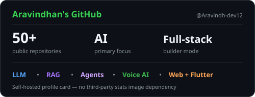
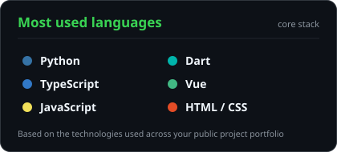
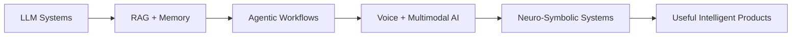

<!-- ============================================================ -->
<!--                     ARAVINDHAN // PROFILE                     -->
<!-- ============================================================ -->

<div align="center">


<a href="https://github.com/Aravindh-dev12">
  
</a>

<br/>


<br/><br/>

<a href="mailto:aravindh1653@gmail.com"></a>
<a href="https://aravindh-dev12.github.io"></a>
<a href="https://github.com/Aravindh-dev12"></a>

</div>

---

## `01 // IDENTITY`

```text
┌──────────────────────────────────────────────────────────────┐
│  USER        Aravindhan                                     │
│  ROLE        AI Builder × Full-Stack Developer              │
│  DOMAIN      LLMs · RAG · Agents · Voice AI · Web · Mobile  │
│  CURRENT     Building intelligent, production-ready systems  │
│  PHILOSOPHY  Build in the shadows. Ship in the light.       │
└──────────────────────────────────────────────────────────────┘
```

I build **AI-native products and full-stack systems** with an emphasis on useful software, strong engineering, and fast iteration.

- 🧠 Building **LLM, RAG, agentic and voice-AI systems**
- ⚡ Shipping across **Next.js, React, Vue, FastAPI, PostgreSQL, Redis and Flutter**
- 🧬 Exploring **neuro-symbolic reasoning, retrieval, inference and local/open-weight LLMs**
- 🛠️ Interested in **developer tools, intelligent interfaces and experimental products**
- 🚀 Optimizing for **real-world utility > demo-only AI**

---

## `02 // TECH MATRIX`

<div align="center">

### `CORE`


### `INTERFACE + APP LAYER`


### `SYSTEMS + DATA`


</div>

<br/>

<div align="center">


</div>

---

## `03 // ACTIVE SIGNALS`

<div align="center">


<br/>




<br/><br/>


</div>

---

## `04 // FEATURED BUILDS`

<table>
<tr>
<td width="50%" valign="top">

### ⚡ [Cieav-web](https://github.com/Aravindh-dev12/Cieav-web)

**AI interface experimentation**

`Vue 3` `WebGPU` `Vite` `AI Interfaces`

> Exploring high-performance, intelligent web experiences.

</td>
<td width="50%" valign="top">

### 🎙️ [Looca Voice AI Agent](https://github.com/Aravindh-dev12/Looca-Voice-AI-Agent)

**Production-oriented voice intelligence**

`Next.js` `TypeScript` `FastAPI` `PostgreSQL` `Qdrant` `Redis`

> Full-stack voice AI architecture with retrieval and persistent data.

</td>
</tr>
<tr>
<td width="50%" valign="top">

### 🧬 [NeuroSymbolic Meta-Reasoning Agent](https://github.com/Aravindh-dev12/NeuroSymbolic-meta-reasoning-agent)

**Hybrid reasoning architecture**

`Python` `Local LLMs` `Symbolic Reasoning` `Vector Memory` `Docker`

> Combining neural generation with structured symbolic reasoning.

</td>
<td width="50%" valign="top">

### 🌐 [My Portfolio](https://github.com/Aravindh-dev12/My-Portfolio)

**Personal developer interface**

`Next.js` `TypeScript`

> A home for projects, experiments and the systems I ship.

</td>
</tr>
</table>

---

## `05 // CURRENT TRAJECTORY`



---

## `06 // OPERATING PRINCIPLES`

```yaml
engineering:
  - solve_real_problems
  - keep_systems_composable
  - measure_before_optimizing
  - automate_repetition

ai:
  - ground_generation
  - design_for_observability
  - evaluate_outputs
  - keep_humans_in_control

shipping:
  - prototype_fast
  - iterate_with_feedback
  - polish_what_matters
  - release
```

---

<div align="center">

### `// END TRANSMISSION`


<br/><br/>

> **“Build in the shadows. Ship in the light.”**


</div>
